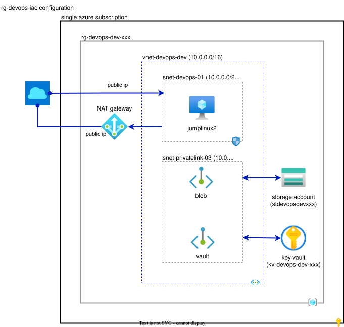

# DevOps IaC Configuration (rg-devops-iac)

## Contents

* [Architecture](#architecture)
* [Overview](#overview)
* [Features](#features)
* [Prerequisites](#prerequisites)
* [Getting Started (Interactive Execution)](#getting-started-interactive-execution)
* [Documentation](#documentation)

## Architecture



## Overview

This configuration provides a minimal set of resources to function as an execution environment for Terraform which is often a critical part of a DevOps pipeline. It is a useful starting point for DevOps / Infrastructure-As-Code (IaC) projects that require a secure and isolated environment for deploying and managing infrastructure using Terraform. The root module creates network, storage and security prerequisites. The virtual machine used as a Terraform execution environment is implemented in a child module which can be repurposed in other environments (such as a platform landing zone) where the resources defined in the root module already exist.

## Features

This section provides a brief overview of the features included in this configuration.

* A pre-configured virtual network, including:
  * A subnet for use by the Linux virtual machine
  * A NAT gateway for outbound internet connectivity
* A pre-configured storage account, including:
  * A container for storing Terraform state files
  * Public access is enabled by design since there may be the first environment provisioned in Azure. This can be disabled once a platform landing zone is in place.
  * Shared access keys are disabled by default and Azure RBAC is used for authorization.
* A pre-configured key vault for managing secrets
* A pre-configured Linux virtual machine for use as a Terraform execution environment implemented as a module for inclusion in other configurations, including:
  * Key vault secrets for secure SSH access to the Linux virtual machine
  * Managed identity role assignments for Azure Blob Storage for use as a Terraform state backend
  * Pre-configured environment variables for Terraform azurerm provider to use managed identities
  * Pre-installed software for IaC / DevOps projects
  * Optional public access for connectivity from the internet
  * Optional registration as a GitHub Actions self-hosted runner for CI/CD workflows (disabled by default)
  * Optional user-assigned managed identity with subscription `Owner` for managed identity (`msi`) sandbox applies (disabled by default)

**NOTE:** The Linux virtual machine is implemented as a module so it can be easily reused in other configurations. It is not intended to be used as a production jumpbox. It is intended to be used as a Terraform execution environment for DevOps / IaC projects.

## Prerequisites

This section describes the prerequisites required in order to provision this configuration.

* [Microsoft Entra ID Tenant and Azure Subscription](#microsoft-entra-id-tenant-and-azure-subscription)
* [Service Principal](#service-principal)
* [Self-Hosted Runner and Managed Identity Prerequisites (Optional)](#self-hosted-runner-and-managed-identity-prerequisites-optional)
* [Other Prerequisites](#other-prerequisites)
* [Terraform Execution Environment](#terraform-execution-environment)

### Microsoft Entra ID Tenant and Azure Subscription

* Identify the [Microsoft Entra ID](https://learn.microsoft.com/en-us/entra/fundamentals/whatis) tenant to be used for identity and access management, or create a new tenant using [Quickstart: Set up a tenant](https://learn.microsoft.com/en-us/entra/identity-platform/quickstart-create-new-tenant).
* Identify a single Azure [subscription](https://learn.microsoft.com/azure/cloud-adoption-framework/ready/considerations/fundamental-concepts#azure-terminology) or create a new Azure subscription. See [Azure Offer Details](https://azure.microsoft.com/support/legal/offer-details/) and [Associate or add an Azure subscription to your Microsoft Entra tenant](https://learn.microsoft.com/entra/fundamentals/how-subscriptions-associated-directory) for more information.
* Identify the owner of the Azure subscription to be used to provision this configuration. This user should have an [Owner](https://learn.microsoft.com/azure/role-based-access-control/built-in-roles#owner) Azure RBAC role assignment on the subscription. See [Steps to assign an Azure role](https://learn.microsoft.com/azure/role-based-access-control/role-assignments-steps) for more information.

### Service Principal

* Verify the subscription owner has privileges to create a service principal on the Microsoft Entra tenant. See [Permissions required for registering an app](https://learn.microsoft.com/en-us/entra/identity-platform/howto-create-service-principal-portal#permissions-required-for-registering-an-app) for more information.
* Ask the subscription owner to [Create an Azure service principal](https://learn.microsoft.com/en-us/cli/azure/azure-cli-sp-tutorial-1?tabs=bash) (SPN) to provision this configuration with [Azure Cloud Shell](https://learn.microsoft.com/azure/cloud-shell/quickstart). The service principal can be created with the following command:

  ```bash
  az ad sp create-for-rbac -n DevOpsSPN --role Owner --scopes /subscriptions/YOUR-SUBSCRIPTION-ID-HERE
  ```

  The output should look like this:

  ```json
  {
    "appId": "YOUR-SERVICE-PRINCIPAL-APP-ID-HERE",
    "displayName": "DevOpsSPN",
    "password": "YOUR-SERVICE-PRINCIPAL-PASSWORD-HERE",
    "tenant": "YOUR-ENTRA-TENANT-ID-HERE"
  }
  ```

Save the service principal *appId* and *password* in a secure location such as a password vault.

### Self-Hosted Runner and Managed Identity Prerequisites (Optional)

These prerequisites apply only if you plan to use this configuration as a self-hosted runner that deploys Azure Sandbox with managed identity authentication (`enable_github_runner = true` and `enable_user_assigned_identity = true`). Arrange them **before** provisioning, because some of them need privileged roles that the person running the deployment may not hold.

* **GitHub repository administrator.** Registering a repository-level runner needs a fine-grained personal access token with `Administration: Read and write` on the target repository, created by a repository administrator. See [Optional: GitHub Actions Self-Hosted Runner](#optional-github-actions-self-hosted-runner).
* **Microsoft Entra Privileged Role Administrator or Global Administrator.** Required only if the sandbox will be deployed with the `mssql` module enabled. The user-assigned managed identity then needs the Microsoft Graph `Group.ReadWrite.All` application permission, and only one of these Entra roles can grant it. Neither the service principal nor an Owner on the subscription can grant it. Read-only Entra roles such as Global Reader are not enough. Privileged Role Administrator is the least privileged role that works. If your organization uses [Privileged Identity Management](https://learn.microsoft.com/entra/id-governance/privileged-identity-management/pim-configure), activate an eligible assignment for the grant, or arrange for an administrator to run it. The grant is a one-time step after the identity is created. See [Optional: User-Assigned Managed Identity for MSI-Mode Sandbox Applies](#optional-user-assigned-managed-identity-for-msi-mode-sandbox-applies).

### Other Prerequisites

* Some Azure subscriptions may have low quota limits for specific Azure resources which may cause failures. See [Resolve errors for resource quotas](https://learn.microsoft.com/azure/azure-resource-manager/templates/error-resource-quota) for more information.
* Some Azure subscriptions may not have the required resource providers registered. Terraform is configured to automatically register the required resource providers, but this may take some time on first use.
* Some Azure subscriptions may not have the required features enabled which may cause failures. Monitor your plan application for errors related to specific subscription features and enable them as needed.
* Some organizations may institute [Azure policy](https://learn.microsoft.com/azure/governance/policy/overview) which may cause failures. This can be addressed by using custom settings which pass the policy checks, or by disabling the policies on the Azure subscription being used for the configurations.

### Terraform Execution Environment

#### Interactive Execution

A variety of Terraform execution environments can be used to provision this configuration interactively, including:

* **Windows-Only Client**: A Windows-only client can be used to run Terraform. The following software should be installed:
  * git
  * PowerShell 7.x
  * Terraform
  * Visual Studio Code

* **Windows Subsystem for Linux (WSL) Client**: WSL offers the best of Windows and Linux in the same client environment and was used to develop this project. The following software should be installed:
  * Linux (WSL) software
    * Linux Distro: Ubuntu 24.04 LTS (Noble Numbat)
    * pip3 Python library package manager and the PyJWT Python library.
    * git
    * Azure CLI
    * Terraform
  * Windows software
    * Visual Studio Code configured for [Remote development in WSL](https://code.visualstudio.com/docs/remote/wsl-tutorial)

* **Linux / MacOs Client**: A Linux or MacOS client can be used to run Terraform. The following software should be installed:
  * git
  * Azure CLI
  * Terraform
  * Visual Studio Code

* **Azure Cloud Shell**: Azure Cloud Shell can be used to run Terraform. Most of the software dependencies are pre-installed.

* **GitHub Codespaces**: GitHub Codespaces has not been tested but should be okay. Most of the software dependencies should be pre-installed.

## Getting Started (Interactive Execution)

This section covers the steps to get started with this configuration using an interactive Terraform execution environment. The steps include logging into Azure, cloning the repository, initializing Terraform, configuring variables, validating and applying the configuration, and smoke testing.

For an attended Bash walkthrough focused on using the VM as a GitHub Actions
self-hosted runner for Azure Sandbox deployments, see the
[GitHub self-hosted runner setup guide](./github-selfhosted-runner-setup.md). It covers preparation,
runner settings, initialization, validation, planning and applying a fresh
bootstrap, runner-readiness checks, the optional Microsoft Graph permission
grant, and cleanup. Configuring and dispatching a Sandbox deployment workflow
is a separate concern.

Continue with the [GitHub Sandbox workflow setup guide](./github-sandbox-workflow-setup.md)
to configure a manually triggered deployment with all base modules enabled
and post-deployment unit/integration testing. That walkthrough currently
covers scope, prerequisites, GitHub discovery, publication and approval
choices, deployment environment protection setup, and smoke-only workflow
creation, local validation, and topic PR preparation.

* [Step 0: Login](#step-0-login)
* [Step 1: Clone the Repository](#step-1-clone-the-repository)
* [Step 2: Initialize Terraform](#step-2-initialize-terraform)
* [Step 3: Configure Variables](#step-3-configure-variables)
* [Step 4: Validate and Apply Configuration](#step-4-validate-and-apply-configuration)
* [Step 5: Complete Smoke Testing](#step-5-complete-smoke-testing)
* [Step 6: Use the Virtual Machine](#step-6-use-the-virtual-machine)
* [Step 7: Clean Up](#step-7-clean-up)

### Step 0: Login

Before you can provision this configuration interactively, you need to log in to your Azure account. Use the following steps to log in

* Open a terminal window and run one of the following commands to log in to Azure according to your preference:

  ```bash
  # Log in using Azure CLI
  az login --use-device-code
  ```

  ```pwsh
  # Log in using PowerShell
  Connect-AzAccount -UseDeviceAuthentication
  ```

* Check the terminal for a message like this:

  ```text
  To sign in, use a web browser to open the page https://microsoft.com/devicelogin and enter the code XXXXXXXXX to authenticate.
  ```

* Open a browser and navigate to the URL provided in the terminal. Enter the code displayed in the terminal to authenticate your Azure account.
* Sign in with an account that has an Azure RBAC `Owner` role assignment on the subscription you will be using to provision this configuration.
* Depending upon how your Entra ID tenant is configured, you may be prompted to enter your password and/or approve a sign-in request on your mobile device.
* Click **Continue** when asked if you are trying to sign in to Azure.
* Check the terminal for a prompt like this:

  ```text
  Retrieving tenants and subscriptions for the selection...

  [Tenant and subscription selection]

  No     Subscription name               Subscription ID                       Tenant
  -----  ------------------------------  ------------------------------------  ----------------
  [1] *  SUBSCRIPTION1-NAME-HERE         SUBSCRIPTION1-ID-HERE                 TENANT-NAME-HERE
  [2]    SUBSCRIPTION2-NAME-HERE         SUBSCRIPTION2-ID-HERE                 TENANT-NAME-HERE

  The default is marked with an *; the default tenant is 'TENANT-NAME-HERE' and subscription is 'SUBSCRIPTION1-NAME-HERE' (SUBSCRIPTION1-ID-HERE).

  Select a subscription and tenant (Type a number or Enter for no changes):
  ```

* Select the subscription you will be using to provision this configuration by entering the number next to it. If you only have one subscription, just press Enter.

### Step 1: Clone the Repository

Clone the Azure Sandbox repository to the Terraform execution environment using the following command:

```bash
git clone https://github.com/Azure-Samples/azuresandbox
```

### Step 2: Initialize Terraform

**WARNING:** By default this configuration assumes you will be using a local Terraform state file which includes sensitive information. This is by design since it is actually creating the storage account where Terraform state files are to be stored for other configurations. This chicken-and-egg bootstrap is the only scenario in this project that legitimately uses local state, and it runs on an interactive Terraform execution environment such as a workstation or Azure Cloud Shell. Configurations applied *after* the bootstrap - including CI/CD workflows running on `jumplinux2` as a self-hosted runner - should use the `azurerm` backend hosted in the storage account this configuration creates.

After cloning the repository, navigate to the `rg-devops-iac` directory and initialize Terraform. This step downloads the necessary provider plugins and modules.

```bash
cd azuresandbox/extras/configurations/rg-devops-iac
terraform init
```

### Step 3: Configure Variables

There many variables in this configuration. Defaults have been set for most of them so only a few need to be set in advance to provision this configuration. There are a few different ways to set variables in Terraform.

* **Environment Variables**: Set environment variables for sensitive information such as passwords and secrets used in the root module.
* **terraform.tfvars file**: Create a `terraform.tfvars` file in the root directory of the project to set variables for the root module.
* **main.tf file**: Override module default values in the `main.tf` file by customizing the module blocks.

Follow these steps to configure the variables for this configuration:

* First, create an environment variable for the service principal password. For security reasons this secret should not be stored in the `terraform.tfvars` file.

  ```bash
  # Set environment variable in bash
  export TF_VAR_arm_client_secret=YOUR-SERVICE-PRINCIPAL-PASSWORD-HERE
  ```

  ```pwsh
  # Set environment variable in PowerShell
  $env:TF_VAR_arm_client_secret = "YOUR-SERVICE-PRINCIPAL-PASSWORD-HERE"
  ```

* Next, create a `terraform.tfvars` file in the root directory of the project. This file should set the necessary variables for your deployment. Here is an example of what the `terraform.tfvars` file might look like:

  ```hcl
  aad_tenant_id   = "YOUR-ENTRA-TENANT-ID-HERE"
  arm_client_id   = "YOUR-SERVICE-PRINCIPAL-APP-ID-HERE"
  location        = "YOUR-AZURE-REGION-HERE"
  subscription_id = "YOUR-AZURE-SUBSCRIPTION-ID-HERE"
  user_object_id  = "YOUR-USER-OBJECT-ID-HERE"

  tags = {
    project     = "devops",
    costcenter  = "mycostcenter",
    environment = "dev"
  }
  ```

  Helper scripts are provided to generate the `terraform.tfvars` file:

  ```bash
  # Bash bootstrap script, run from the root directory of the project
  ./scripts/bootstrap.sh
  ```

  ```pwsh
  # PowerShell bootstrap script, run from the root directory of the project
  ./scripts/bootstrap.ps1
  ```

#### **Overriding Defaults**

The variable defaults set in this configuration can be overridden by customizing the `terraform.tfvars` file or modifying the module block in `main.tf`. For example, the default value for the `vm_jumpbox_linux_name` variable in the vm-jumpbox-linux module is `jumplinux2`. You can override this value by adding the following to the vnet-shared module block in `main.tf`:

```hcl
module "vm_jumpbox_linux" {
  source = "./modules/vm-jumpbox-linux"

  enable_public_access = true
  key_vault_id         = azurerm_key_vault.this.id
  location             = azurerm_resource_group.this.location
  resource_group_name  = azurerm_resource_group.this.name
  storage_account_id   = azurerm_storage_account.this.id
  subnet_id            = azurerm_subnet.this.id
  tags                 = var.tags

  depends_on = [time_sleep.wait_for_roles]

  # Override defaults here
  vm_jumpbox_linux_name = "devopsagent1"
}
```

#### **Optional: GitHub Actions Self-Hosted Runner**

The Linux virtual machine can optionally be registered as a [GitHub Actions self-hosted runner](./modules/vm-jumpbox-linux/README.md#github-actions-self-hosted-runner) so it can run CI/CD workflows using the pre-installed IaC toolchain and the VM managed identity. This is **disabled by default**.

To enable it:

* Create a GitHub personal access token (PAT) with `administration:write` on the target repository, or `organization_self_hosted_runners:write` on the target organization. Set it using an environment variable so it is not stored in the `terraform.tfvars` file:

  ```bash
  # Set environment variable in bash
  export TF_VAR_github_runner_token=YOUR-GITHUB-PAT-HERE
  ```

  ```pwsh
  # Set environment variable in PowerShell
  $env:TF_VAR_github_runner_token = "YOUR-GITHUB-PAT-HERE"
  ```

* Add the following to the `terraform.tfvars` file:

  ```hcl
  enable_github_runner = true
  github_runner_url    = "https://github.com/YOUR-ORG-HERE/YOUR-REPO-HERE"
  github_runner_labels = ["azuresandbox"]
  ```

The token is stored as a **write-only** key vault secret, so it is never written to Terraform state, and it is read on the VM at provisioning time using the VM managed identity. When `enable_github_runner` is `false` no runner software is installed and the VM behaves exactly as it did before.

Workflows running on the runner should store Terraform state in the `azurerm` backend hosted in the storage account provisioned by this configuration, not in a local state file on the runner. See [Terraform State for CD Workflows](./modules/vm-jumpbox-linux/README.md#terraform-state-for-cd-workflows).

If the registration URL is a repository URL the runner is registered as a repository level runner and runner groups do not apply. See [Runner Scope](./modules/vm-jumpbox-linux/README.md#runner-scope).

By default the runner service account is granted command scoped passwordless `sudo` for the binaries used by the `vwan` point-to-site VPN integration tests. Review [Elevated Permissions for Integration Tests](./modules/vm-jumpbox-linux/README.md#elevated-permissions-for-integration-tests) and disable it if the runner will not execute those tests.

#### **Optional: User-Assigned Managed Identity for MSI-Mode Sandbox Applies**

The root Azure Sandbox configuration can authenticate with a managed identity instead of a service principal secret (`arm_auth_mode = "msi"`), for example from a CD workflow running on the self-hosted runner. That mode requires a **user-assigned** managed identity attached to the Terraform execution environment. This configuration can create one for you. This is **disabled by default**.

To enable it, add the following to the `terraform.tfvars` file:

```hcl
enable_user_assigned_identity = true
```

When enabled, the identity is:

* Created in the resource group provisioned by this configuration.
* Assigned the `Owner` role at the subscription scope, because sandbox applies create role assignments. This is a standing, privileged identity. Owner on the subscription also includes this configuration's own resource group, so anything running on `jumplinux2` that uses this identity can modify or delete it.
* Attached to `jumplinux2` **in addition to** the system-assigned identity. The system-assigned identity remains the VM's default identity, so cloud-init, the runner registration script, `az login --identity` and the `azurerm` state backend (`ARM_USE_MSI`) keep using it. Use the user-assigned identity explicitly by its client id, e.g. `az login --identity --client-id <client-id>` or `Connect-AzAccount -Identity -AccountId <client-id>`.

Enabling or disabling the identity on an existing deployment updates the VM in place. It does not replace the VM.

After the apply, use the `user_assigned_identity_client_id` output as `arm_client_id` in the root sandbox `terraform.tfvars`, together with `arm_auth_mode = "msi"`.

If the sandbox will be deployed with the `mssql` module enabled, the identity also needs the Microsoft Graph `Group.ReadWrite.All` application permission, which this configuration cannot grant. A Global Administrator or Privileged Role Administrator must grant it once, after the identity is created:

```bash
# Run from this configuration's directory, signed in to Azure CLI as a Privileged Role Administrator or Global Administrator
./scripts/grant-graph-permissions.sh
```

The script reads the identity from the `user_assigned_identity_principal_id` output (or takes a principal id as its first argument), and skips permissions that are already granted, so it is safe to re-run. If you activated the Entra role just before running it, sign in again with `az login` so the new role is included in your token.

Managed identities have no app registration, so the Entra admin center **API permissions** steps used for a service principal do not apply. Use the script above instead. The grant is removed automatically if the identity is deleted.

### Step 4: Validate and Apply Configuration

Remember that Terraform will compare the state of existing resources in Azure with what it expects to be there when creating a plan. If the state of existing resources in Azure does not match what Terraform expects, the plan will modify existing resources to match the configuration. This can happen when resources are modified manually or via Policy outside of Terraform. This is known as "drift".

Follow these steps to validate and apply the configuration:

* First, validate that the configuration is syntactically correct:

  ```bash
  terraform validate
  ```

* Next, create a plan to see what resources will be created:

  ```bash
  terraform plan
  ```

  * **IMPORTANT:** If you are provisioning this configuration for the first time, you will see a lot of `+` signs in the output. This indicates that new resources will be created if this plan is applied. If you are updating this configuration after it has been provisioned, you may see `~` signs indicating that existing resources will be updated. If you see `-` signs, this indicates that existing resources will be deleted. Be careful with these operations as they may cause data loss.

* Finally, apply the configuration to create the resources:

  ```bash
  terraform apply
  ```

* Monitor the progress of the apply operation in the console. If errors occur, that may not be reflected in the console immediately. Terraform will try to apply as much of the plan as possible first, then will show the errors when it is done. It can take up to 15 minutes to provision this configuration. If everything goes well you should see a message like this:

  ```text
  Apply complete! Resources: XX added, XX changed, XX destroyed.
  ```

### Step 5: Complete Smoke Testing

After the configuration has been provisioned, complete the smoke testing procedures in the `vm-jumpbox-linux` module.

### Step 6: Use The Virtual Machine

You now have a fully provisioned DevOps IaC environment! You can use it as a Terraform execution environment interactively or via DevOps pipelines.

### Step 7: Clean Up

Don't forget to delete your DevOps IaC environment when you're done. You don't want to have to explain to your boss why you left an unused resources laying around that costs your company money. The quickest way to clean up is to delete the DevOps IaC resource group. Do this with care because data loss will occur, including any Terraform state files in the Azure Blob Storage container.

**NOTE:** If you enabled `enable_github_runner`, deleting the virtual machine does not deregister the self-hosted runner from GitHub. Either remove the runner from the VM before deleting it:

```bash
# Run on jumplinux2
sudo /opt/actions-runner/svc.sh stop
sudo /opt/actions-runner/svc.sh uninstall
sudo -u githubrunner /opt/actions-runner/config.sh remove --token YOUR-REMOVAL-TOKEN-HERE
```

...or delete the stale offline runner afterwards from GitHub > *Settings* > *Actions* > *Runners*.

If you only need to remove Terraform state file(s) from the Azure Blob Storage container without deleting the whole environment, use `scripts/delete-tfstate.sh`. It authenticates with Azure CLI / Microsoft Entra ID only (the storage account has shared access keys disabled) and relies on the built-in RBAC role assignments granted to the caller (e.g. jumplinux2's managed identity) to delete blobs over the storage account's private endpoint — it does not enable public network access, so it must be run from a host with private network connectivity to the storage account, such as jumplinux2. Run it with no arguments to list and select blob(s) interactively, or pass a blob name (e.g. `azuresandbox.tfstate`) to delete it directly:

```bash
./scripts/delete-tfstate.sh                       # list and select interactively
./scripts/delete-tfstate.sh azuresandbox.tfstate  # delete a specific blob
./scripts/delete-tfstate.sh --yes azuresandbox.tfstate  # skip confirmation prompt
```

## Documentation

This section provides documentation regarding the overall structure of the root module for this configuration. See the README.md files in each module directory for more information about that module.

* [Root Module Structure](#root-module-structure)
* [Root Module Input Variables](#root-module-input-variables)
* [Root Module Resources](#root-module-resources)
* [Child Modules](#child-modules)
* [Virtual Network Design](#virtual-network-design)
* [Dependencies](#dependencies)

### Root Module Structure

This configuration is organized into the following structure:

```plaintext
├── images/                               # 
│   └── rg-devops-iac-diagram.drawio.svg  # Architecture diagram
├── modules/                              # 
│   └── vm-jumpbox-linux/                 # Linux jumpbox virtual machine module
├── scripts/                              # 
│   ├── bootstrap.sh                      # Bash helper script for generating terraform.tfvars
│   ├── bootstrap.ps1                     # PowerShell helper script for generating terraform.tfvars
│   ├── cleanterraformtemp.sh             # Bash helper script for removing Terraform temp/local files
│   ├── enable-public-access.sh           # Bash helper script for re-enabling public access on key vault/storage account
│   ├── grant-graph-permissions.sh        # Bash helper script for granting Microsoft Graph permissions to the user-assigned managed identity
│   └── delete-tfstate.sh                 # Bash helper script for deleting Terraform state blob(s) from the storage backend
├── locals.tf                             # Local variables 
├── main.tf                               # Resource configurations
├── network.tf                            # Network resource blocks
├── outputs.tf                            # Output variables 
├── providers.tf                          # Provider configuration blocks
├── storage.tf                            # Storage resource blocks
├── terraform.tf                          # Terraform configuration block
└── variables.tf                          # Variable definitions
```

### Root Module Input Variables

This section lists input variables used in the root module. Defaults can be overridden by specifying a different value in terraform.tfvars.

Variable | Default | Description
--- | --- | ---
aad_tenant_id | | The Microsoft Entra tenant id.
arm_client_id | | The AppId of the service principal used for authenticating with Azure. Must have a 'Contributor' role assignment.
arm_client_secret | | The password for the service principal used for authenticating with Azure. Set interactively or using an environment variable 'TF_VAR_arm_client_secret'.
enable_github_runner | false | Set to true to install and register the GitHub Actions self-hosted runner agent on `jumplinux2`. See [vm-jumpbox-linux](./modules/vm-jumpbox-linux/README.md#github-actions-self-hosted-runner).
enable_user_assigned_identity | false | Set to true to create a user-assigned managed identity with an `Owner` role assignment on the subscription and attach it to `jumplinux2`, for root sandbox applies with `arm_auth_mode = "msi"`. See [Optional: User-Assigned Managed Identity for MSI-Mode Sandbox Applies](#optional-user-assigned-managed-identity-for-msi-mode-sandbox-applies).
github_runner_labels | `["azuresandbox"]` | Additional labels to apply to the GitHub Actions self-hosted runner. Only used when `enable_github_runner` is true.
github_runner_token | | A GitHub personal access token or runner registration token used to register the self-hosted runner. Set interactively or using an environment variable 'TF_VAR_github_runner_token'. Required when `enable_github_runner` is true.
github_runner_token_secret_version | 1 | Increment to write a new value for the GitHub runner token key vault secret.
github_runner_token_type | `pat` | The type of token supplied in `github_runner_token`, either `pat` or `registration`.
github_runner_url | | The GitHub repository or organization URL to register the self-hosted runner with, e.g. `https://github.com/myorg/myrepo`. Required when `enable_github_runner` is true.
location | | The name of the Azure Region where resources will be provisioned.
storage_access_tier | Hot | The access tier for the new storage account.
storage_replication_type | LRS | The type of replication for the new storage account.
subnet_address_prefix | 10.0.0.0/24 | The address prefix for the miscellaneous subnet. The minimum size is /29.
subnet_name | snet-devops-01 | The name of the subnet to be created in the new virtual network.
subnet_privatelink_address_prefix | 10.0.1.0/24 | The address prefix for the PrivateLink subnet
subnet_privatelink_name | snet-privatelink-03 | The name of the subnet for PrivateLink endpoints
subscription_id | | The Azure subscription id used to provision resources.
storage_container_name | tfstate | The name of the storage container to be created in the new storage account.
tags | | The tags in map format to be used when creating new resources.
user_object_id | | The object id of the user in Microsoft Entra ID.
vm_jumpbox_linux_size | `Standard_D2ls_v6` | The size of the jumpbox virtual machine (`jumplinux2`).
vnet_address_space | 10.0.0.0/16 | The address space in CIDR notation for the new virtual network. The minimum size is /24.
vnet_name | devops | The name of the new virtual

### Root Module Resources

The root module includes a resource group, key vault and storage account used by the child modules. It also implements Azure RBAC role assignments for both the service principal used by Terraform as well as the interactive user.

Address | Name | Notes
--- | --- | ---
azurerm_key_vault.this | kv-devops-dev-xxx | Used to store secrets for the Linux virtual machine.
azurerm_nat_gateway.this | ng-devops-dev | NAT gateway for outbound internet connectivity.
azurerm_nat_gateway_public_ip_association.this | | Associates the NAT gateway with the public IP address.
azurerm_network_security_group.devops | nsg-devops-dev-snet-devops-01 | NSG used to open inbound connectivity for port 22 (SSH) to the Linux virtual machine.
azurerm_private_dns_zone.key_vault | privatelink.vaultcore.azure.net | Private DNS zone for Azure Key Vault
azurerm_private_dns_zone.storage_blob | privatelink.blob.core.windows.net | Private DNS zone for Azure blob storage
azurerm_private_dns_zone_virtual_network_link.key_vault | | Links private dns zone to azurerm_virtual_network.this
azurerm_private_dns_zone_virtual_network_link.storage_blob | | Links private dns zone to azurerm_virtual_network.this
azurerm_private_endpoint.key_vault | pe-devops-dev-key-vault | Private endpoint for Azure key vault
azurerm_private_endpoint.storage_blob | pe-devops-dev-storage-blob | Private endpoint for Azure blob storage
azurerm_public_ip.this | pip-devops-dev-nat | Public IP address for the NAT gateway.
azurerm_resource_group.this | rg-devops-dev-xxx | Resource group for all resources in this configuration.
azurerm_role_assignment.keyvault_roles[*] | | Assigns `Key Vault Secrets Officer` to both the service principal and the interactive user.
azurerm_role_assignment.storage_roles[*] | | Assigns `Storage Blob Data Contributor` to both the service principal and the interactive user.
azurerm_role_assignment.user_assigned_identity_owner[0] | | Assigns `Owner` at the subscription scope to the user-assigned managed identity. Created only when `enable_user_assigned_identity` is true.
azurerm_storage_account.this | stdevopsdevxxx | Storage account for storing Terraform state files.
azurerm_storage_container.this | tfstate | Storage container for storing Terraform state files.
azurerm_subnet.devops | snet-devops-01 | Subnet for jumplinux2 VM
azurerm_subnet.privatelink | snet-privatelink-03 | Subnet for PrivateLink endpoints
azurerm_subnet_nat_gateway_association.devops | vnet-devops-dev-devops| Associates the NAT gateway with the subnet.
azurerm_subnet_network_security_group_association.this | | Associates the NSG with the subnet.
azurerm_user_assigned_identity.this[0] | uai-devops-dev-xxx | User-assigned managed identity for root sandbox applies with `arm_auth_mode = "msi"`, attached to `jumplinux2`. Created only when `enable_user_assigned_identity` is true.
azurerm_virtual_network.this | vnet-devops-dev-devops | Virtual network for the Linux virtual machine.

### Root Module Output Variables

This section includes a list of output variables returned by the root module.

Name | Comments
--- | ---
github_runner_name | The name the GitHub Actions self-hosted runner is registered with, or `null` when `enable_github_runner` is false.
resource_ids | A map of resource IDs for key resources in the configuration.
resource_names | A map of resource names for key resources in the configuration.
user_assigned_identity_client_id | The client id of the user-assigned managed identity, used as `arm_client_id` for root sandbox applies with `arm_auth_mode = "msi"`, or `null` when `enable_user_assigned_identity` is false.
user_assigned_identity_principal_id | The principal (object) id of the user-assigned managed identity, used to grant Microsoft Graph application permissions, or `null` when `enable_user_assigned_identity` is false.

### Child Modules

The following [modules](./modules/) are included in this configuration:

Name | Required | Depends On | Description
--- | --- | --- | ---
[vm-jumpbox-linux](./modules/vm-jumpbox-linux/) | No | Root module | Creates a preconfigured Linux jumpbox VM in the DevOps virtual network.

### Virtual Network Design

This configuration implements a virtual network. Default address ranges are set artificially high for demos and readability and can be overridden with smaller ranges to meet specific requirements. An firewall is not included in this configuration by design as it may be used as an startup environment to provision a platform landing zone or sandbox that does include a firewall. The virtual network includes two subnets:

* A subnet for the Linux virtual machine. The subnet is configured with a NAT gateway for outbound internet connectivity and an NSG to control inbound traffic.
* A subnet for PrivateLink endpoints for Azure Key Vault and Azure Blob Storage

### Dependencies

This section covers the dependencies in this configuration.

* [Source Control](#source-control)
* [Terraform](#terraform)
* [Scripting Technologies](#scripting-technologies)
* [Continuous Integration / Continuous Delivery](#continuous-integration--continuous-delivery)
* [Configuration Management Technologies](#configuration-management-technologies)
* [Operating Systems](#operating-systems)

#### **Source Control**

The configuration is hosted on GitHub and uses Git for source control. The repository is organized into configurations and modules, making it easy to navigate and understand the structure of the project. The [vm-jumpbox-linux] module can be repurposed for use in other configurations.

#### **Terraform**

This project is built built using Terraform, a cross platform, open-source Infrastructure as Code (IaC) tool that allows users to define, provision and version cloud infrastructure using a declarative configuration language called HCL (HashiCorp Configuration Language).

* **Providers**: The following Terraform providers are used in the project:
  * **azurerm**: Used to manage Azure resources.
  * **cloudinit**: Used to configure Linux virtual machines.
  * **random**: Used to generate random values for resource attributes.
  * **time**: Used to implement wait cycles and other time based operations.
  * **tls**: Used to generate the SSH public and private key pairs for the Linux virtual machine.
* **Modules**: The following Terraform modules are used in this project:
  * **Azure/naming**: A module for generating consistent and compliant Azure resource names.

#### **Scripting Technologies**

The following cross-platform scripting technologies are used in this project:

* **PowerShell**:  Used for general purpose scripting and to implement Terraform provisioners and Azure custom script extensions.
* **Az PowerShell Module**: Used to connect to and configure Azure resources from PowerShell scripts.
* **Bash**: Used for general purpose scripting.
* **Azure CLI**: Used for connecting to Azure resources from Bash scripts.

#### **Continuous Integration / Continuous Delivery**

* **GitHub Actions**: The Linux virtual machine can optionally be registered as a self-hosted runner so GitHub Actions workflows can execute Terraform from within the virtual network using the VM managed identity. Such workflows should store Terraform state in the `azurerm` backend hosted in the storage account provisioned by this configuration rather than in a local state file on the runner. See [vm-jumpbox-linux](./modules/vm-jumpbox-linux/README.md#github-actions-self-hosted-runner).

#### **Configuration Management Technologies**

The following configuration management technologies are used in this project to configure virtual machines:

* **cloud-init**: Used to configure Linux virtual machines.

#### **Operating Systems**

The following operating systems are used for the various virtual machines in the sandbox:

Virtual Machine | Role | Module | Operating System
--- | --- | --- | ---
jumplinux2 | Linux Jumpbox VM | vm-jumpbox-linux | Ubuntu Server LTS 24.04 (Nobel Numbat)
