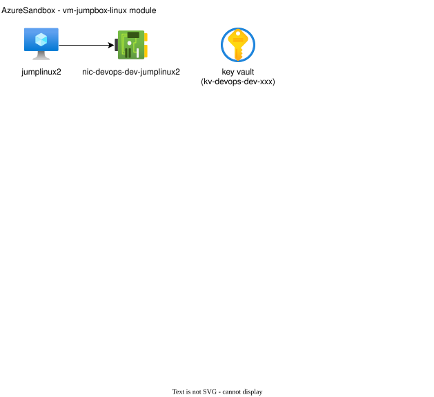

# Linux Jumpbox Virtual Machine Module (vm-jumpbox-linux)

## Contents

* [Architecture](#architecture)
* [Overview](#overview)
* [GitHub Actions Self-Hosted Runner](#github-actions-self-hosted-runner)
* [Smoke Testing](#smoke-testing)
* [Documentation](#documentation)

## Architecture



## Overview

This module implements a stand-alone Linux virtual machine for use as a jumpbox or DevOps agent. The VM is configured using cloud-init and offers the following capabilities:

* Secure SSH access using a private SSH key stored in Azure Key Vault.
* Automatic swapfile provisioning sized to the VM's memory (larger VMs get no swap).
* Remote-ssh development capabilities using Visual Studio Code.
* Pre-installed software packages, including:
  * azure-cli
  * jp
  * powershell
  * python3-pip
  * terraform
* Pre-configured environment variables for using Azure Blob Storage as a Terraform state backend.
* Optional registration as a [GitHub Actions self-hosted runner](#github-actions-self-hosted-runner), disabled by default.

## GitHub Actions Self-Hosted Runner

This module can optionally install and register the [GitHub Actions runner](https://github.com/actions/runner) agent on the VM so it can be used as a self-hosted runner for CI/CD workflows. This capability is **disabled by default**: when `enable_github_runner` is `false` nothing is installed and the VM behaves exactly as it did before.

When `enable_github_runner` is `true`:

* The GitHub personal access token (PAT) or runner registration token is stored as a **write-only** key vault secret (`value_wo`), so it is never written to Terraform state. It is also never written to the VM custom data.
* The VM managed identity is granted the `Key Vault Secrets User` role, and cloud-init reads the secret from key vault at provisioning time using that managed identity.
* When `github_runner_token_type` is `pat` (the default), the PAT is exchanged on the VM for a short lived runner registration token using the GitHub REST API. Use `registration` instead if you already have a registration token.
* The runner agent is installed to `/opt/actions-runner`, registered with the configured repository or organization URL and labels, then installed as a **systemd service** (`actions.runner.*`) so it starts automatically after a reboot.
* The service runs under a non-root local service account (`githubrunner` by default). The pre-installed toolchain (`terraform`, `az`, `pwsh` with Az modules) is on the runner `PATH`, and `ARM_USE_MSI` / `ARM_TENANT_ID` are set in the runner service environment file (`/opt/actions-runner/.env`) so workflows authenticate to Azure with the VM managed identity. No Azure secrets are stored on the VM.

### Terraform State for CD Workflows

Workflows running on this self-hosted runner should **always** use the `azurerm` backend hosted in the
storage account provisioned by the root module. A runner is disposable infrastructure, so a local
state file on it is an anti-pattern:

* **Locking.** The `azurerm` backend takes a blob lease, so concurrent workflow runs - or a workflow
  run and an interactive `terraform apply` on the same VM - cannot corrupt state. A local state file
  has no lock beyond a single Terraform invocation.
* **Durability.** The VM is replaceable. Resizing, reimaging or recreating it destroys anything held
  only on the OS disk, including a local state file. Blob storage supports versioning and soft delete.
* **Secrets at rest.** Terraform state contains sensitive values. In the backend it is encrypted,
  scoped by Azure RBAC and reachable only over the storage account private endpoint. On the VM it is a
  plain file readable by the runner service account and by anything that compromises a workflow job.
* **Shared source of truth.** Interactive runs on the VM and CD runs operate on the same state instead
  of diverging.

The VM managed identity is already granted `Storage Blob Data Contributor` on the storage account, so
no secrets are required:

```hcl
# backend.tf
terraform {
  backend "azurerm" {
    use_azuread_auth     = true
    use_msi              = true
    tenant_id            = "YOUR-ENTRA-TENANT-ID-HERE"
    subscription_id      = "YOUR-AZURE-SUBSCRIPTION-ID-HERE"
    storage_account_name = "YOUR-STORAGE-ACCOUNT-NAME-HERE"
    container_name       = "tfstate"
    key                  = "YOUR-STATE-FILE-NAME-HERE.tfstate"
  }
}
```

```yaml
- uses: actions/checkout@v5

- run: terraform init

- run: terraform apply -auto-approve
```

Because the runner always uses a remote backend, this module deliberately does **not** provision a
persistent local state directory on the VM. Nothing a workflow writes to the runner work directory is
guaranteed to survive the next job, since `actions/checkout` cleans the workspace by default.

Local state is only used during the **bootstrap apply of this configuration**, which is a separate
concern: that apply creates the storage account, so the backend does not exist yet and the state file
has to live on the Terraform execution environment running the apply - a workstation or an existing
Terraform execution environment, never this runner, which does not exist until that apply completes.
See the root [README](../../README.md) for details.

### Token Permissions

Use a *fine-grained* personal access token. Classic personal access tokens are legacy, cannot be scoped as narrowly, and may be blocked by organization or enterprise policy.

The PAT supplied in `github_runner_token` is only used to obtain a registration token and requires:

* For a repository runner: *Repository permissions* -> **Administration: Read and write** (`administration:write`), with *Repository access* set to *Only select repositories* and the target repository selected.
* For an organization runner: *Organization permissions* -> **Self-hosted runners: Read and write** (`organization_self_hosted_runners:write`) on the target organization.

A token that is missing these permissions returns `403 Resource not accessible by personal access token` when exchanging the PAT for a registration token.

Grant no other permissions. The PAT is stored as a write-only key vault secret, read at boot by the virtual machine's managed identity, and exchanged for a short lived registration token. The runner agent itself never uses the PAT. Note that the PAT is long lived and must be rotated manually.

### Runner Scope

The registration scope is derived from `github_runner_url`:

Scope | Example `github_runner_url` | Notes
--- | --- | ---
Repository | `https://github.com/myorg/myrepo` | Runner groups are not supported, so `github_runner_group` is ignored.
Organization | `https://github.com/myorg` | `github_runner_group` is passed to the registration and must already exist.

Runner groups are an organization and enterprise feature. Passing a runner group when registering a repository level runner fails with `Could not find any self-hosted runner group named ...`, so the configuration script omits it automatically for repository runners.

### Elevated Permissions for Integration Tests

The runner service account is unprivileged. The `vwan` integration tests in [Test-Integration-VwanConnectivity.ps1](../../../../../scripts/Test-Integration-VwanConnectivity.ps1) establish a point-to-site VPN tunnel, which requires root to create the `tun` device and update the routing table.

When `github_runner_enable_vwan_sudoers` is true (the default), the configuration script installs a command scoped sudoers drop-in at `/etc/sudoers.d/azuresandbox-github-runner` granting the runner service account passwordless `sudo` for only the binaries those tests invoke: `openvpn`, `cat`, `tail`, `kill` and `pkill`. The drop-in is written with `0440` permissions, owned by `root`, and validated with `visudo -cf` before it takes effect. If validation fails it is removed and cloud-init fails rather than leaving `sudo` broken.

**IMPORTANT:** This is a privilege grant. Passwordless root `cat`, `tail`, `kill` and `pkill` allow the runner service account to read any file on the VM and signal any process, which means any workflow job that runs on this runner inherits that capability. Set `github_runner_enable_vwan_sudoers` to `false` if the runner will not execute the `vwan` integration tests.

## Smoke Testing

This section describes how to test the module after deployment.

**IMPORTANT:** Wait for 5 minutes to proceed to allow time for cloud-init configurations to complete.

* [Download SSH private key from Azure Key Vault](#download-ssh-private-key-from-azure-key-vault)
* [Determine public IP address of *jumplinux2*](#determine-public-ip-address-of-jumplinux2)
* [Connect to *jumplinux2* using SSH](#connect-to-jumplinux2-using-ssh)
* [Connect to *jumplinux2* using Visual Studio Code](#connect-to-jumplinux2-using-visual-studio-code)
* [Verify the GitHub Actions self-hosted runner](#verify-the-github-actions-self-hosted-runner)

### Download SSH private key from Azure Key Vault

* Navigate to *portal.azure.com* > *Key Vaults* > *kv-devops-dev-xxxxxxxx*
* Click on *Secrets*
* Click on *jumplinux2-ssh-private-key*
* Click on the most current version to view the secret details.
* Click on *Show Secret Value* to view the private SSH key.
* Copy the private SSH key value to the clipboard.
* Paste the private SSH key value into a text editor and save it locally as:

  ```plaintext
  C:\Users\<user-name-here>\.ssh\devopsbootstrapadmin-ssh-key-private.txt
  ```

### Determine public IP address of *jumplinux2*

* Navigate to *portal.azure.com* > *Virtual machines* > *jumplinux2*
* Make a note of the *Public IP address* in the *Essentials* section

### Connect to *jumplinux2* using SSH

* Open a PowerShell terminal.
* Execute the following command to connect to *jumplinux1*:

  ```powershell
  ssh -i .\.ssh\devopsbootstrapadmin-ssh-key-private.txt devopsbootstrapadmin@PUBLIC-IP-ADDRESS-HERE
  ```

* Verify *jumplinux2* cloud-init configuration is complete using the following commands:

  ```bash
  # Check to see if cloud-init configuration is complete
  cloud-init status

  # Check software versions
  lsb_release -a
  az --version
  terraform --version
  pwsh --version
  pwsh -c "Get-InstalledModule Az"

  # Check Terraform environment variables
  echo $ARM_USE_MSI
  echo $ARM_TENANT_ID
  ```

### Connect to *jumplinux2* using Visual Studio Code

* Navigate to *Start* > *Visual Studio Code* > *Visual Studio Code*.
* Click on the blue *Open a Remote Window* icon in the lower left corner
* If you see *Select an option to open a Remote Window*, choose *SSH*
* Click on the blue *Open a Remote Window* icon in the lower left corner
* For *Select an option to open a Remote Window* choose *Connect to Host...*
* For *Select configured SSH host or enter user@host* choose *+ Add New SSH Host...*
* For *Enter SSH Connection Command* enter the following:

  ```plaintext  
  ssh devopsbootstrapadmin@PUBLIC-IP-ADDRESS-HERE
  ```

* Configure private SSH key for *jumplinux2*
  * Click on the blue *Open a Remote Window* icon in the lower left corner
  * Click *Connect to Host...*
  * Click *Configure SSH Hosts...*
  * Select `C:\users\YOUR-USER-NAME-HERE\.ssh\config
  * The config file will open in Visual Studio Code:

  ```yaml
  Host PUBLIC-IP-ADDRESS-HERE
    HostName PUBLIC-IP-ADDRESS-HERE
    User devopsbootstrapadmin
  ```

  * Update the config file as follows:

  ```yaml
  Host jumplinux2
    HostName PUBLIC-IP-ADDRESS-HERE
    User devopsbootstrapadmin
    IdentityFile C:\\Users\\YOUR-USER-NAME-HERE\\.ssh\\devopsbootstrapadmin-ssh-key-private.txt
  ```

* Save the file and close it.

* Connect to *jumplinux2*
  * Click on the blue *Open a Remote Window* icon in the lower left corner
  * For *Select an option to open a Remote Window* choose *Connect to Host...*
  * For *Select configured SSH host or enter user@host* choose *jumplinux2*
  * A new Visual Studio Code window will open.
  * For *Select the platform of the remote host "jumplinux2"* choose *Linux*
  * For *"jumplinux2" has fingerprint...* choose *Continue*
  * Verify that *SSH:jumplinux2* is displayed in the blue status section in the lower left corner.
  * Navigate to *View* > *Explorer*
  * Click *Open Folder*
  * For *Open Folder* select the default folder (home directory) and click *OK*.
  * Navigate to *View* > *Terminal*.
  * Inspect the configuration of *jumplinux2* by executing the following Bash commands:

    ```bash
    # Check software versions
    lsb_release -a
    az --version
    terraform --version
    pwsh --version
    pwsh -c "Get-InstalledModule Az"

    # Check Terraform environment variables
    echo $ARM_USE_MSI
    echo $ARM_TENANT_ID
    ```

### Verify the GitHub Actions self-hosted runner

Only applicable when `enable_github_runner` is set to `true`.

* Connect to *jumplinux2* using SSH or Visual Studio Code as described above.
* Verify the runner agent was installed and registered:

  ```bash
  # Review the cloud-init output for the runner configuration script
  sudo grep configure-github-runner /var/log/cloud-init-output.log

  # Confirm the runner is registered
  sudo cat /opt/actions-runner/.runner

  # Confirm the runner service is installed and running
  sudo systemctl status 'actions.runner.*'

  # Confirm the runner service environment
  sudo cat /opt/actions-runner/.env
  ```

* Navigate to the target repository or organization on GitHub > *Settings* > *Actions* > *Runners* and verify that a runner named *jumplinux2* is listed with an *Idle* status and the expected labels.

## Documentation

This section provides additional information on various aspects of this module.

* [Dependencies](#dependencies)
* [Module Structure](#module-structure)
* [Input Variables](#input-variables)
* [Module Resources](#module-resources)
* [Output Variables](#output-variables)

### Dependencies

This module depends upon resources provisioned in the following modules:

* Root module

### Module Structure

This module is organized as follows:

```plaintext
├── images/
|   └── vm-jumpbox-linux-diagram.drawio.svg # Architecture diagram
├── scripts/
|   ├── configure-github-runner.sh          # cloud-init shell script to install/register the GitHub Actions runner
|   ├── configure-github-runner.yaml        # cloud-init cloud-config file with GitHub Actions runner settings
|   ├── configure-powershell.ps1            # cloud-init shell script to configure PowerShell
|   └── configure-vm-jumpbox-linux.yaml     # cloud-init cloud-config file to configure the VM
├── compute.tf                              # Compute resource configurations
├── main.tf                                 # Resource configurations
├── network.tf                              # Network resource configurations
├── outputs.tf                              # Output variables
├── terraform.tf                            # Terraform configuration block
└── variables.tf                            # Input variables
```

### Input Variables

This section lists the default values for the input variables used in this module. Defaults can be overridden by specifying a different value in the root module.

Variable | Default | Description
--- | --- | ---
admin_username | `devopsbootstrapadmin` | The user name for the admin account on the VM.
admin_username_secret | adminuser | The name of the key vault secret that contains the user name for the admin account. Defined in the vnet-shared module.
enable_github_runner | false | When enabled the GitHub Actions self-hosted runner agent is installed on the VM and registered with the repository or organization specified in `github_runner_url`. When disabled nothing is installed.
enable_public_access | false | When enabled a public IP address is created for the VM. When disabled, the VM is only accessible via a private IP address.
github_runner_enable_vwan_sudoers | `true` | Set to true to grant the runner service account command scoped passwordless sudo for the binaries used by the `vwan` point-to-site VPN integration tests. Only used when `enable_github_runner` is true.
github_runner_group | `Default` | The name of the GitHub Actions runner group to register the runner with. Ignored for repository level runners, which do not support runner groups. Only used when `enable_github_runner` is true.
github_runner_labels | `["azuresandbox"]` | Additional labels to apply to the self-hosted runner. Only used when `enable_github_runner` is true.
github_runner_name | | The name to register the runner with. Defaults to the VM name when left empty. Only used when `enable_github_runner` is true.
github_runner_service_account | `githubrunner` | The name of the non-root local service account the runner runs under. Only used when `enable_github_runner` is true.
github_runner_token | | A GitHub personal access token or runner registration token used to register the runner. Set using an environment variable `TF_VAR_github_runner_token`. Required when `enable_github_runner` is true. Stored as a write-only key vault secret so it never lands in Terraform state.
github_runner_token_secret | `github-runner-token` | The name of the key vault secret used to pass the GitHub registration token to the VM at provisioning time.
github_runner_token_secret_version | 1 | Increment to write a new value for the `github_runner_token` key vault secret.
github_runner_token_type | `pat` | The type of token supplied in `github_runner_token`. Use `pat` for a personal access token, which is exchanged for a short lived registration token on the VM, or `registration` for a registration token obtained from the GitHub API.
github_runner_url | | The GitHub repository or organization URL to register the runner with, e.g. `https://github.com/myorg/myrepo`. Required when `enable_github_runner` is true.
github_runner_version | `2.338.0` | The version of the GitHub Actions runner agent to install, without the leading `v`.
key_vault_id | | The ID of the key vault defined in the root module.
key_vault_name | | The name of the key vault defined in the root module. Used by cloud-init to read secrets from the VM using the managed identity.
location | | The Azure region where the resources will be created. Defined in the root module.
resource_group_name | | The name of the resource group defined in the root module.
ssh_private_key_version | 1 | Increment to create new ssh_private_key.
storage_account_id | | The resource ID of of the storage account defined in the root module.
subnet_id | | The resource ID of the subnet where the VM will be deployed. Defined in the vnet-shared module.
tags | | The tags from the root module.
vm_jumpbox_linux_image_offer | `ubuntu-24_04-lts` | The offer type of the virtual machine image used to create the VM.
vm_jumpbox_linux_image_publisher | `Canonical` | The publisher for the virtual machine image used to create the VM.
vm_jumpbox_linux_image_sku | `server` | The SKU of the virtual machine image used to create the VM.
vm_jumpbox_linux_image_version | `Latest` | The version of the virtual machine image used to create the VM.
vm_jumpbox_linux_name | jumplinux2 | The name of the VM.
vm_jumpbox_linux_size | | The size of the virtual machine.
vm_jumpbox_linux_storage_account_type | `StandardSSD_LRS` | The storage type to be used for the VM's OS disk. Standard HDD (`Standard_LRS`) is not permitted because Azure is retiring Standard HDD OS disks on September 8, 2028.

### Module Resources

This section lists the resources included in this configuration.

Address | Name | Notes
--- | --- | ---
module.vm_jumpbox_linux.azurerm_key_vault_secret.adminuser | adminuser | The Key Vault secret containing the admin username for the Linux virtual machine.
module.vm_jumpbox_linux.azurerm_key_vault_secret.github_runner_token[0] | github&#8209;runner&#8209;token | The write-only Key Vault secret containing the GitHub registration token, created only when `var.enable_github_runner` is enabled. The value is never stored in Terraform state.
module.vm_jumpbox_linux[0].azurerm_key_vault_secret.ssh_private_key | jumplinux1&#8209;ssh&#8209;private&#8209;key | The private SSH key stored in Azure Key Vault.
module.vm_jumpbox_linux[0].azurerm_linux_virtual_machine.this | jumplinux2 | The Linux virtual machine resource.
module.vm_jumpbox_linux[0].azurerm_network_interface.this | nic&#8209;devops&#8209;dev&#8209;jumplinux2 | The network interface associated with the Linux virtual machine.
module.vm_jumpbox_linux.azurerm_public_ip.this[0] | pip&#8209;devops&#8209;dev&#8209;jumplinux2 | The public IP address associated with the Linux virtual machine, if `var.enable_public_access` is enabled.
module.vm_jumpbox_linux.azurerm_role_assignment.github_runner_key_vault[0] | | Grants `Key Vault Secrets User` role to the managed identity of jumplinux2 so cloud-init can read the GitHub registration token. Created only when `var.enable_github_runner` is enabled.
module.vm_jumpbox_linux.azurerm_role_assignment.this | | Grants `Storage Blob Data Contributor` role to the managed identity of jumplinux2. This is intended to be used for accessing a Terraform state backend hosted in Azure Blob Storage.
module.vm_jumpbox_linux[0].tls_private_key.ssh_key | | The TLS private key used for SSH authentication.

### Output Variables

This section includes a list of output variables returned by the module.

Name | Description
--- | ---
github_runner_name | The name the GitHub Actions self-hosted runner is registered with, or `null` when `var.enable_github_runner` is false.
resource_ids | A map of resource IDs for key resources in the module.
resource_names | A map of resource names for key resources in the module.
