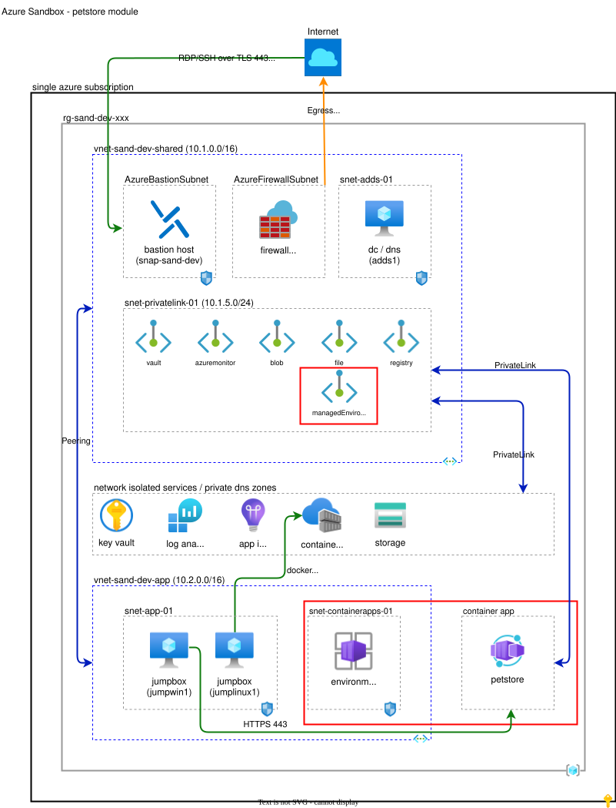

# Petstore Container App Module (petstore)

## Contents

* [Architecture](#architecture)
* [Overview](#overview)
* [Smoke Testing](#smoke-testing)
* [Documentation](#documentation)

## Architecture



## Overview

This module deploys a demo [petstore](https://petstore.swagger.io/) RESTful API using **Azure Container Apps**, instrumented with **Azure Monitor Application Insights**. The container app is network isolated, and Azure RBAC is used to pull container images from a network isolated shared container registry.

Application Insights observability is added without any application code changes by baking the standalone [Application Insights Java agent](https://learn.microsoft.com/azure/azure-monitor/app/opentelemetry-enable?tabs=java) into the image (attached to the JVM via `JAVA_TOOL_OPTIONS`). Because the shared container registry has public network access disabled, the instrumented image is built and pushed from *jumplinux1* (the in-VNet Docker host provisioned by the *vm-jumpbox-linux* module) using its system-assigned managed identity, orchestrated by an `azurerm_virtual_machine_run_command`. The shared Application Insights resource has local (instrumentation key) authentication disabled, so the container app authenticates to it with **Microsoft Entra ID** using its own system-assigned managed identity (granted *Monitoring Metrics Publisher*) and the `APPLICATIONINSIGHTS_AUTHENTICATION_STRING=Authorization=AAD` environment variable.

The estimated provisioning time for this module is 15 minutes.

## Smoke Testing

Follow these steps after deployment to validate functionality.

1. Fetch the Petstore FQDN output:
   * In Terraform: `terraform output fqdns`

2. From *jumpwin1*, launch Edge and navigate to the petstore FQDN. This should display the Swagger UI for the petstore API.

3. Try navigating to the petstore FQDN from your local machine. This should fail, as the Container App network isolated.

4. Generate some traffic (e.g. refresh the Swagger UI a few times), then verify request telemetry has been ingested. From *jumplinux1* (Application Insights query is only reachable over the private network):

   ```bash
   az monitor app-insights query \
     --app <application-insights-resource-id> \
     --analytics-query "AppRequests | where TimeGenerated > ago(30m) | summarize count() by ResultCode"
   ```

   > This telemetry-ingestion check is also automated: `Test-Integration-Petstore.ps1` (run via `Invoke-UnitTests.ps1 -Module petstore -Integration`) queries the Log Analytics workspace from *jumpwin1* and asserts that `AppRequests` with `AppRoleName='petstore'` have been ingested, confirming the end-to-end Entra ID telemetry path.

## Documentation

Additional information about this module.

* [Dependencies](#dependencies)
* [Module Structure](#module-structure)
* [Input Variables](#input-variables)
* [Module Resources](#module-resources)
* [Output Variables](#output-variables)

### Dependencies

This module depends upon resources provisioned in the following modules:

* Root
* vnet-shared (key vault, log analytics)
* vnet-app (Windows jumpbox, virtual networks / subnets, private DNS zones, container registry, Application Insights)
* vm-jumpbox-linux (Linux jumpbox *jumplinux1* with Docker CLI, used to build and push the instrumented image)

### Module Structure

```plaintext
├── images/
|   └── petstore-diagram.drawio.svg     # Architecture diagram for module
├── scripts/
|   ├── build-petstore-image.sh         # Builds/pushes the instrumented image on jumplinux1
|   └── Test-Petstore.ps1               # Unit test script
├── Dockerfile                          # Adds the Application Insights Java agent to the stock image
├── locals.tf                           # Local values (derived names, build script)
├── main.tf                             # Container App, Environment, run command & role assignments
├── network.tf                          # Private endpoint
├── outputs.tf                          # Module outputs
├── terraform.tf                        # Terraform configuration block
└── variables.tf                        # Input variables
```

### Input Variables

Variable | Default | Description
--- | --- | ---
app_insights_connection_string |  | Connection string of the shared Application Insights resource (sensitive; endpoint/resource pointer only).
app_insights_id |  | Resource ID of the shared Application Insights resource telemetry is published to.
appinsights_agent_version | 3.7.9 | Version of the Application Insights Java agent to install; also used as the image tag.
appinsights_role_name | petstore | Cloud role name (AppRoleName) reported to Application Insights.
container_apps_subnet_id |  | Resource ID of subnet for the Container Apps Environment infrastructure.
container_registry_id |  | The resource ID of an existing Azure Container Registry (ACR) to receive the image.
jumplinux1_principal_id |  | Principal ID of the jumplinux1 managed identity (granted AcrPush to build/push the image).
jumplinux1_vm_id |  | Resource ID of the jumplinux1 VM used to build and push the instrumented image.
location |  | Azure region for deployment (lowercase, numbers, dashes only).
log_analytics_workspace_id |  | Resource ID of Log Analytics workspace used for diagnostics.
private_dns_zone_id |  | Resource ID of private DNS zone linked to the managed environment.
private_endpoint_subnet_id |  | Subnet where the private endpoint to the Container Apps Environment is placed.
resource_group_name |  | Name of the existing resource group.
source_container_image | swaggerapi/petstore31:latest | Stock base image (repo/image:tag) used for the instrumented build.
tags |  | Map of resource tags.
unique_seed |  | Unique seed appended to generated names (via Azure naming module).

### Module Resources

Address | Name | Notes
--- | --- | ---
azurerm_container_app.this | petstore | Runs the instrumented petstore image; has a system-assigned identity for Entra ID telemetry auth.
azurerm_container_app_environment.this | cae-sand-dev-xxx | Managed Container Apps Environment.
azurerm_private_endpoint.this | pe-sand-dev-cae | Private endpoint for the Container Apps Environment.
azurerm_role_assignment.acr_pull | | Grants the environment managed identity AcrPull on the shared registry.
azurerm_role_assignment.acr_push | | Grants the jumplinux1 managed identity AcrPush on the shared registry.
azurerm_role_assignment.app_insights_publisher | | Grants the container app identity Monitoring Metrics Publisher on Application Insights.
azurerm_virtual_machine_run_command.build_image | BuildPetstoreImage | Builds and pushes the instrumented image from jumplinux1 (in-VNet, keeps the registry private).
module.naming | | Azure naming module instance for consistent resource naming.

### Output Variables

Name | Description
--- | ---
fqdns | The FQDN of the Petstore Container App ingress.
resource_ids | Resource ids for resources provisioned in this module.
resource_names | Resource names for resources provisioned in this module.
