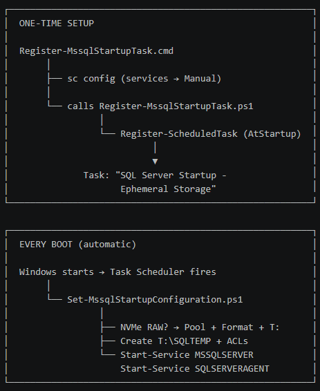

# Azure SQL VM Ephemeral NVMe Storage – Startup Automation

## Problem

On Azure v6, v7-series, and FXmdsv2 VMs, local NVMe temp disks arrive as RAW unformatted disks after every stop/deallocate event. SQL Server fails to start because the tempdb folder no longer exists.

This solution automatically provisions the NVMe storage and starts SQL Server on every boot.

## Files

| **File** | **Purpose** |
| --- | --- |
| Set-MssqlStartupConfiguration.ps1 | Startup script - pools/formats NVMe disks, creates SQLTEMP folder, starts SQL Server |
| Register-MssqlStartupTask.cmd | One-time setup - sets services to Manual, registers the scheduled task |
| Register-MssqlStartupTask.ps1 | One-time setup helper - called by the .cmd file |

## Prerequisites

- **OS:** Windows Server 2025
- **SQL Server:** SQL Server 2022 or 2025 (default instance)
- **VM Size:** Azure v6-series with local NVMe temp storage (also supports v5-series with SCSI temp disk)
- **tempdb already moved:** SQL Server must already be configured to use the ephemeral drive for tempdb (e.g., T:\SQLTEMP\tempdb.mdf)
- **Administrator access:** The .cmd setup script must be run as Administrator

## Process



## Installation

### Step 1: Copy files to the VM

Copy all three files to C:\Scripts\ on the Azure VM:

```text
C:\Scripts\
├── Set-MssqlStartupConfiguration.ps1
├── Register-MssqlStartupTask.cmd
└── Register-MssqlStartupTask.ps1
```

### Step 2: Run the registration script (once)

Open an **Administrator command prompt** and run:

C:\Scripts\Register-MssqlStartupTask.cmd

This will:

- Set MSSQLSERVER and SQLSERVERAGENT services to **Manual** startup
- Register a Windows Scheduled Task named **"SQL Server Startup - Ephemeral Storage"** that runs at every boot as NT AUTHORITY\SYSTEM

You should see:

=== Setting SQL Server services to Manual startup ===

[SC] ChangeServiceConfig SUCCESS

[SC] ChangeServiceConfig SUCCESS

=== Registering scheduled task: SQL Server Startup - Ephemeral Storage ===

=== SUCCESS: Scheduled task registered. ===

### Step 3: Test

- **Stop/deallocate** the VM from the Azure portal
- **Start** the VM
- After boot, verify:
  - T: drive exists and is formatted NTFS
  - T:\SQLTEMP folder exists
  - SQL Server and SQL Agent services are running
  - Check the log: C:\Scripts\Set-MssqlStartupConfiguration.log

## How It Works

On every VM start, the scheduled task executes Set-MssqlStartupConfiguration.ps1 which:

- **Detects the temp drive** - checks for existing D: (v5) or T: (v6)
- **If volume is missing** - finds RAW NVMe Direct Disks, pools them via Storage Spaces (Simple/RAID-0), formats NTFS with 64KB allocation unit, assigns drive letter T:
- **Creates SQLTEMP folder** - with correct ACLs for the SQL Server service account
- **Starts SQL Server** - then starts SQL Agent

If the volume already exists (soft reboot, no deallocation), it skips provisioning and just ensures the folder and services are ready.

## Customization

| **Setting** | **Location** | **Default** |
| --- | --- | --- |
| Drive letter | $NVMeDriveLetter in .ps1 | T |
| Temp folder name | $TempFolderName in .ps1 | SQLTEMP |
| Allocation unit size | $AllocationUnit in .ps1 | 65536 (64KB) |
| SQL instance name | $SQLServiceName in .ps1 | MSSQLSERVER |
| Script path | -File argument in Register .ps1 | C:\Scripts\Set-MssqlStartupConfiguration.ps1 |

For a **named instance**, change:

$SQLServiceName = "MSSQL$MYINSTANCE"

$SQLAgentName   = "SQLAgent$MYINSTANCE"

## Troubleshooting

| **Symptom** | **Check** |
| --- | --- |
| SQL Server not starting after dealloc | Review C:\Scripts\Set-MssqlStartupConfiguration.log |
| Task not running | Task Scheduler → check "SQL Server Startup - Ephemeral Storage" last run result |
| NVMe disks not detected | Run `Get-PhysicalDisk |
| Drive letter conflict | Ensure no other disk/DVD uses T: |
| Permission denied on SQLTEMP | Check ACL: `Get-Acl T:\SQLTEMP |

## References

- [Place tempdb on ephemeral storage (Microsoft Learn)](https://learn.microsoft.com/azure/azure-sql/virtual-machines/windows/tempdb-ephemeral-storage)
- [FAQ for Temp NVMe disks](https://learn.microsoft.com/azure/virtual-machines/enable-nvme-temp-faqs)
- [Storage best practices for SQL Server on Azure VMs](https://learn.microsoft.com/azure/azure-sql/virtual-machines/windows/performance-guidelines-best-practices-storage)
